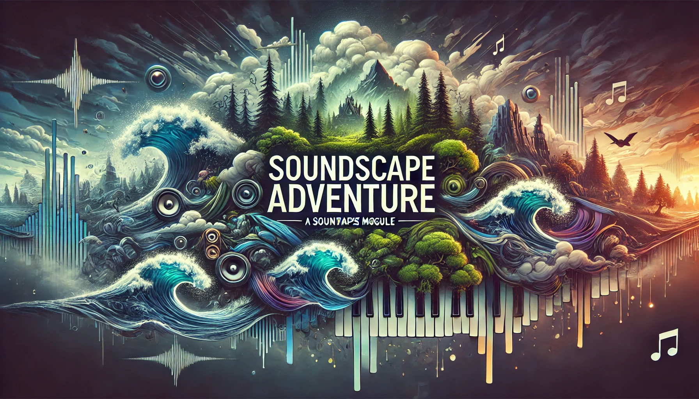

# Soundscape Adventure for FoundryVTT
  

## Overview

The Soundscape Adventure module for FoundryVTT enhances your tabletop RPG experience by providing dynamic and immersive soundscapes. This module automates the organization and playback of ambient, random, and looped sounds, allowing you to create rich audio environments with minimal effort.

## Features

- **Directory Scanning**: Automatically scans specified directories for ambient, random, and loop sounds, organizing them into soundscapes.
- **Mood Creation**: Create various moods for each soundscape, enabling quick transitions between different audio settings.
- **Cross-World Configuration**: Once configured, your soundscapes and moods are saved and can be used across any world in FoundryVTT, eliminating the need for reconfiguration.
- **Random Sound Playback**: Play sounds randomly from a designated group, adding variety and unpredictability to your soundscapes.
- **Loop Sound Groups**: Organize loop sounds into groups where each sound represents a different intensity. For example, create a loop group for rain sounds ranging from a light drizzle to a heavy storm and adjust the intensity within your mood settings.

## Installation

1. Open FoundryVTT and go to the `Manage Modules` menu.
2. Click on `Install Module`.
3. Search for "Soundscape Adventure" in the module browser.
4. Click `Install` next to the Soundscape Adventure entry.
5. Enable the module in FoundryVTT through the `Manage Modules` menu.

## Configuration

1. **Directory Setup**: Specify the directories where your sound files are located. The module will scan these directories for ambient, random, and loop sounds. Make sure you are following the mandatory structure of folders (go to the section `Folder Structure` for more details).
2. **Soundscape Creation**: Create soundscapes by organizing your sounds into ambient, random, and loop categories.
3. **Mood Setup**: Define different moods for each soundscape. Each mood can have unique settings for ambient, random, and loop sounds, allowing you to switch between different audio environments seamlessly.
4. **Intensity Adjustment**: For loop sound groups, adjust the intensity of the sounds to match the desired mood. For example, adjust rain sounds from a drizzle to a storm as needed.

## Usage

1. **First-Time Setup**: The first time you enable the module in a world, a dialog will prompt you to select the source folder of your soundscapes. Choose the folder containing your sound files.
2. **Loading Soundscapes**: Go to the `Music` tab in the sidebar and select `Load Soundscape`. Choose the desired soundscape from the list.
3. **Creating Moods**: Once the soundscape is loaded in the sidebar, open it and create your moods. Each mood can have different settings for ambient, random, and loop sounds, providing flexibility in your audio environment.
4. **Playing Sounds**: Select a soundscape and choose a mood. The module will automatically play the configured sounds.
5. **Adjusting Moods**: Switch between different moods to change the audio environment dynamically. Each mood's settings are saved and can be easily recalled.
6. **Cross-World Accessibility**: Once your soundscapes and moods are configured, they are available in any world you create, providing a consistent audio experience across all your campaigns.

## Folder Structure

You need to decide on a folder that will contain all your soundscapes. For example, let's suppose you want to create two soundscapes: the first is a Tavern soundscape, and the second is a Forest soundscape.

I decided to have the soundscapes in the folder `my_soundscapes/`. The next step is to create two subfolders: Tavern and Forest (try to avoid spaces when naming folders).

Inside the Tavern folder, create three subfolders: Ambience, Random, and Loop. Keep the folder names with an initial uppercase letter. Now, place your ambient sounds within the Ambience folder, the random sounds within the Random folder, and the loop sounds within the Loop folder.

Since tavern sounds can be random, you might want to play some sounds randomly as part of the same group of sounds. For this, create a new folder within the Random folder. Place various sounds of people talking, playing, singing, and more in this new folder. Give this folder a descriptive name. In your soundscape, you will see a random group with the name of this folder, and each time, a new random sound will play.

For the Forest soundscape, you might want something different. For instance, you may want to have a group of looped sounds that simulate varying intensities of a specific sound, like rain. In this case, you could have five sounds of rain, each more intense than the previous one. This allows you to select the intensity of the rain, from a weak drizzle to a storm.

For the Forest soundscape, follow the same steps as for the Tavern soundscape. However, for the rain sounds, create a new folder within the Loop folder named Rain. Now, your soundscape will display a loop group named Rain and an extra bar that allows you to select the intensity of the rain.

## Where find sounds
Musics and SFXs can be found on internet for free from the sites below:
- [Pixabay SFX](https://pixabay.com/sound-effects) and [Pixabay Music](https://pixabay.com/music) login is required.
- [Free archive of sound effects from the BBC](https://sound-effects.bbcrewind.co.uk/)
- [Free sound effects from Adobe](https://www.adobe.com/products/audition/offers/AdobeAuditionDLCSFX.html)
- [Reddit list of additional free gamedev sound effects](https://www.reddit.com/r/gamedev/comments/3b2hym/16_great_websites_featuring_free_game_sounds_for/) 
- [Zapsplat free but limited sound effects](https://www.zapsplat.com/) 
- [Music, sound effects, and more!](https://superdevresources.com/free-music-sound-effects-games/)
- [Curated collection of copyright-free sounds by Igor Teuri](https://igorteuri.itch.io/pacote-de-musicas-para-rpg-sem-copyright)

## Contributing

Contributions are welcome! If you have suggestions, bug reports, or feature requests, please open an issue or submit a pull request on the [GitHub repository](#).

## License

This module is licensed under the GPL 3.0 License. See the [LICENSE](https://github.com/piecesofcodecom/soundscape-adventure/blob/main/LICENSE) file for more information.
The sounds available in the sample folder (sample-root-soundscapes) are from [Pixabay](http://www.pixabay.com) and the GPL doesn't apply to those sounds, please visit the [Pixabay license summary](https://pixabay.com/service/license-summary/) for more details. They have many sounds that you can use in your games.

---

Enjoy creating immersive audio experiences in your FoundryVTT games with the Soundscape Adventure!
