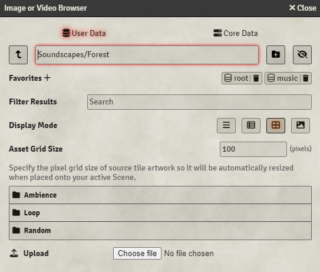
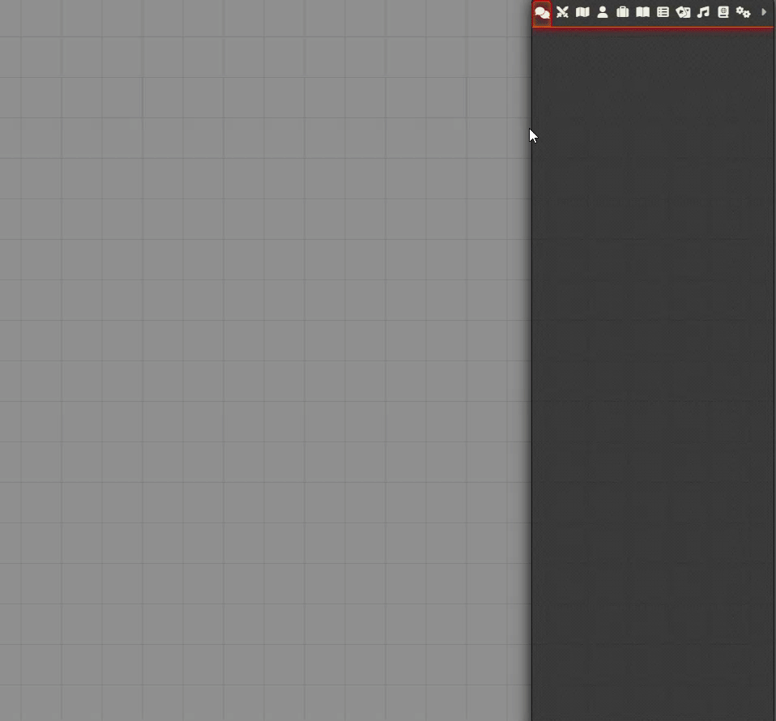

**Soundscape Adventure Tutorial**

Welcome to the Soundscape Adventure tutorial! In this guide, we will cover how the module works, initial configuration, creating soundscapes, setting up moods, and creating sounds that can be used by all soundscapes.

> [!IMPORTANT]  
> Crucial information necessary for users to succeed.

> **_NOTE:_** The note content.
You can find a complete example of a soundscape within the module folder, in the folder named `root-soundscapes`.

### How the Module Works

The Soundscape Adventure module operates by reading a root folder that you select. Within this root folder, each subfolder is treated as a separate soundscape.

Soundscapes are collections of sounds that exhibit specific behaviors. There are three types of sounds:

1. **Ambience Sounds**: Continuous sounds that play in the background, creating an immersive atmosphere.
2. **Loop Sounds**: These sounds also play continuously but are typically shorter and repeat more frequently compared to ambience sounds.
3. **Random Sounds**: These sounds play at random intervals, adding an element of unpredictability and variety to the soundscape.

Both Loop and Random sounds can be grouped. Detailed instructions on how to group sounds are covered in the "Groups of Sounds" section of this tutorial.

Select the root folder to see an example of a soundscape.

### Creating a Root Folder

When you enable the module in a world, it will prompt you to select its root folder. This root folder is where your soundscapes will live. If you choose a folder with existing soundscapes, they will be available in your world.

### Creating a Soundscape

Now that we have the root folder set up, let's create our first soundscape. In Soundscape Adventure, each subfolder within the root folder is treated as a separate soundscape.

For this example, we will create a soundscape named "Forest." Follow these steps to set up your forest-themed soundscape:

1. **Create a Folder:** Within the root folder, create a new folder named "Forest." This will be the main directory for your forest soundscape.
2. **Set Up Subfolders:** Inside the "Forest" folder, create three subfolders named:
   - **Loop**
   - **Random**
   - **Ambience**

These subfolders categorize the sounds based on their behavior:
- **Loop:** Sounds in this folder will play in a continuous loop.
- **Random:** Sounds in this folder will play at random intervals.
- **Ambience:** Sounds in this folder will play as background ambience.

At the end, your soundscape folder structure should look like this:

By organizing your sound files into these folders, you ensure that Soundscape Adventure can correctly identify and play them according to their intended behavior.

### Adding Sounds to the Soundscape

With the folders in place, we need to start adding the sound files to their respective folders. Let's add three sounds and refresh the page. After adding the sounds, it's time to load the soundscape.

### Creating Moods

Once the soundscape is available, you'll need to create a mood. Moods help organize sounds within a soundscape, such as for a sunny day or a rainy night.

After creating a mood:
1. All sounds will be displayed in red, indicating they are disabled by default.
2. Increasing the volume will enable the sound.

Play the mood, enable some sounds, and save your mood. Always save your mood to persist the changes. This way, the next time you open this soundscape, the mood will have those sounds enabled, even in another world.

### Groups of Sounds

Soundscape Adventure supports grouping some sounds. These groups will behave differently.

- **Random Sounds Group:** This group allows a sound to play at intervals from a group of sounds instead of always playing the same sound.
- **Loop Sounds Group:** This group has a different behavior. The sounds within the group need to be ordered alphabetically. Each sound represents an intensity that you can increase or decrease.

To configure these sounds, create a folder within the respective folders. To create a group of loops, create a folder inside the "Loop" folder. For a group of random sounds, create a folder inside the "Random" folder.

### Using Global Sounds

The soundboard also allows you to have global sounds. Organize the global sounds like a soundscape, naming the folder "global." Soundscape Adventure will automatically share the sounds within the global folder to all soundscapes.

### Conclusion

These are the basic functions of the Soundscape Adventure module. We hope you enjoyed this tutorial and that it helps you plan the next moods for your games.